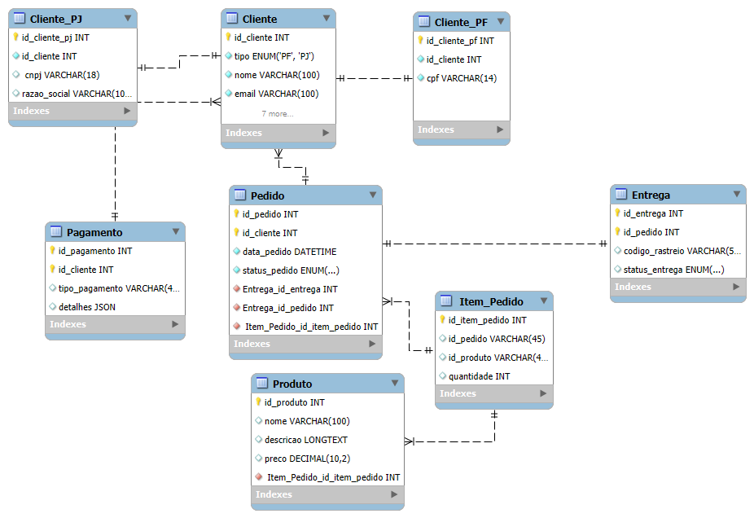

# Projeto de Banco de Dados para E-Commerce

Este projeto consiste em um modelo conceitual de banco de dados para um sistema de e-commerce. A estrutura inclui:

- Cadastro de clientes (Pessoa Física e Pessoa Jurídica).
- Gestão de pagamentos com múltiplas formas de pagamento.
- Controle de pedidos e entregas com status e código de rastreio.

## Tabelas principais:
- Cliente
- Cliente_PF
- Cliente_PJ
- Pagamento
- Pedido
- Entrega
- Produto
- Item_Pedido

## Diagrama do Banco de Dados

